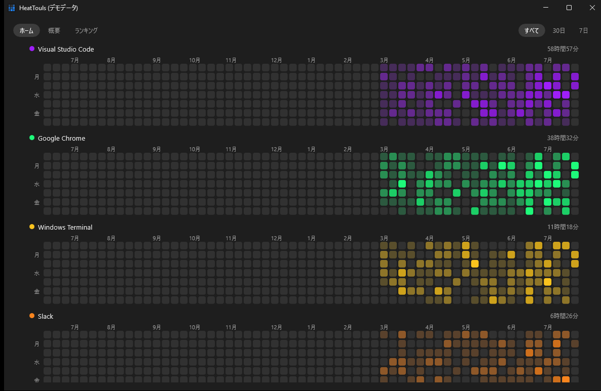
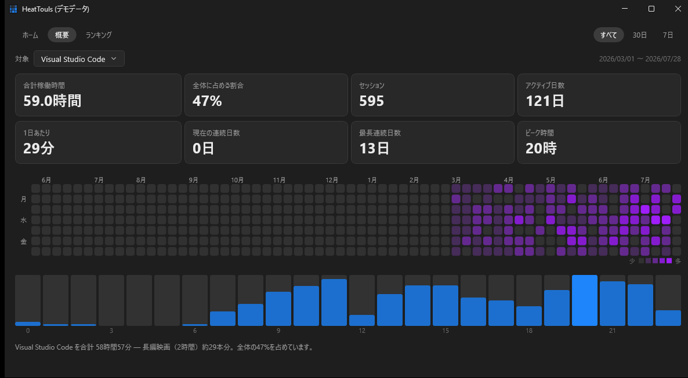
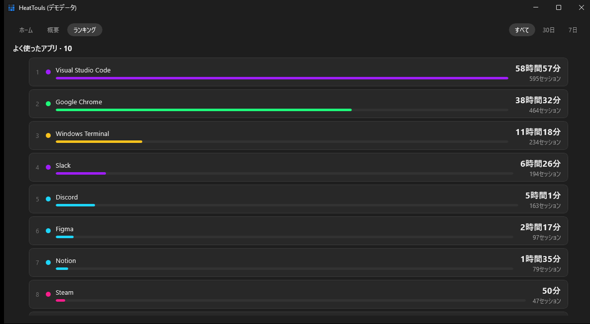

# HeatTouls

> **ベータ版 (v0.1.0-beta)** — 動作しますが、まだ検証が十分でない部分があります。

PC で使ったアプリの **アクティブ時間** を自動で計測し、ヒートマップに可視化する
Windows 常駐ツールです。計測対象を登録する必要はなく、前面に出たアプリが自動で一覧に増えていきます。

Windows 11 / .NET 9 + WinUI 3。



## 画面

3つのタブに分かれています。アプリ名をクリックすると、そのアプリの詳細が開きます。

| タブ | 内容 |
| --- | --- |
| ホーム | アプリごとの日別ヒートマップを一覧表示（上の画像） |
| 概要 | アプリを1つ選び、統計カード・ヒートマップ・時間帯別を見る |
| ランキング | よく使ったアプリを稼働時間順に並べる |





使用時間が長い日ほどマスの色が濃くなります。右上の `すべて / 30日 / 7日` で集計範囲を切り替えられます。

## できること

- 前面ウィンドウを1秒ごとに見て、アプリごとのアクティブ時間を積算する
- 3分以上の無操作はアイドルとみなして計上しない（つけっぱなしで数字が膨らまない）
- 合計稼働時間 / 割合 / セッション数 / アクティブ日数 / 連続日数 / ピーク時間
- タスクトレイ常駐。ウィンドウを閉じてもバックグラウンドで計測を続ける

## 使う

[Releases](https://github.com/rin0420/HeatTouls/releases/latest) から `HeatTouls-win-x64.zip` を
ダウンロードして展開し、`HeatTouls.exe` をダブルクリックするだけで動きます。
.NET ランタイムも Windows App SDK も同梱しているので、事前のインストールは不要です。

署名していないため、初回起動時に SmartScreen の警告が出ることがあります
（「詳細情報」→「実行」で起動できます）。

ログオン時の自動起動:

```powershell
.\HeatTouls.exe --autostart on       # 登録（--minimized で登録される）
.\HeatTouls.exe --autostart off      # 解除
```

ショートカット: `Ctrl+R` で再集計、`Esc` でウィンドウを閉じる（トレイへ）。

## データの保存先

`%LOCALAPPDATA%\HeatTouls\usage.db`（SQLite）。**外部への送信は一切行いません。**
`HEATTOULS_DB` でファイルを、`HEATTOULS_DATA_DIR` でフォルダを上書きできます。

## 自分でビルドする

[.NET 9 SDK](https://dotnet.microsoft.com/download) だけあればビルドできます（Visual Studio は不要）。

```powershell
.\build.ps1                      # dist\HeatTouls\HeatTouls.exe
.\build.ps1 -Runtime win-arm64   # ARM64 向け
```

ソースから直接起動する場合:

```powershell
dotnet run --project src\HeatTouls                    # 通常起動
dotnet run --project src\HeatTouls -- --minimized     # トレイのみ
dotnet run --project src\HeatTouls -- --demo          # サンプルデータでUIを確認（別DB）
```

計測やUIの調整値は [src/HeatTouls/Core/Config.cs](src/HeatTouls/Core/Config.cs) の定数にまとまっています。

## 制限

- Windows専用（Win32 APIを直接使うため）
- 配布物はフォルダ形式（約 218MB）。WinUI 3 は多数のネイティブDLLを伴うため単一 exe にできない
- 「アクティブ時間」＝前面ウィンドウの時間。バックグラウンドで動いているだけのアプリは計上されない
- 管理者権限で動いているアプリはパスを取得できず、記録されないことがある
